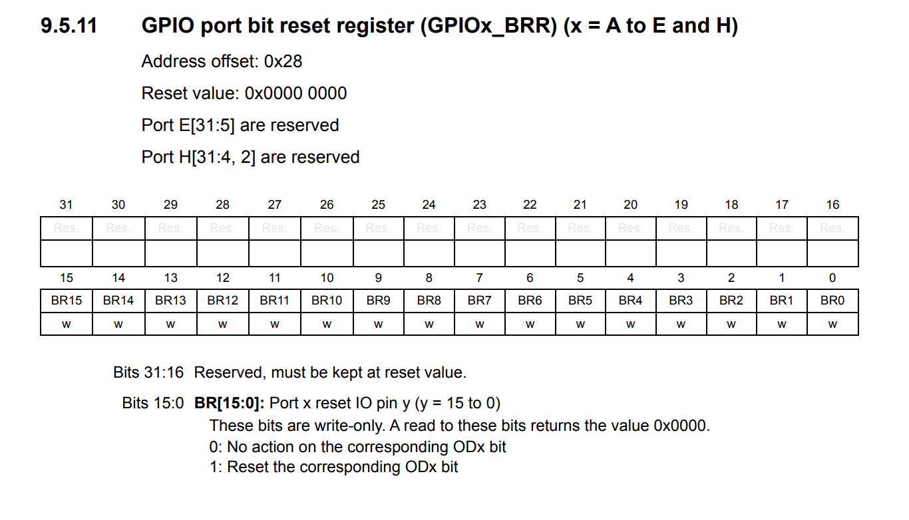
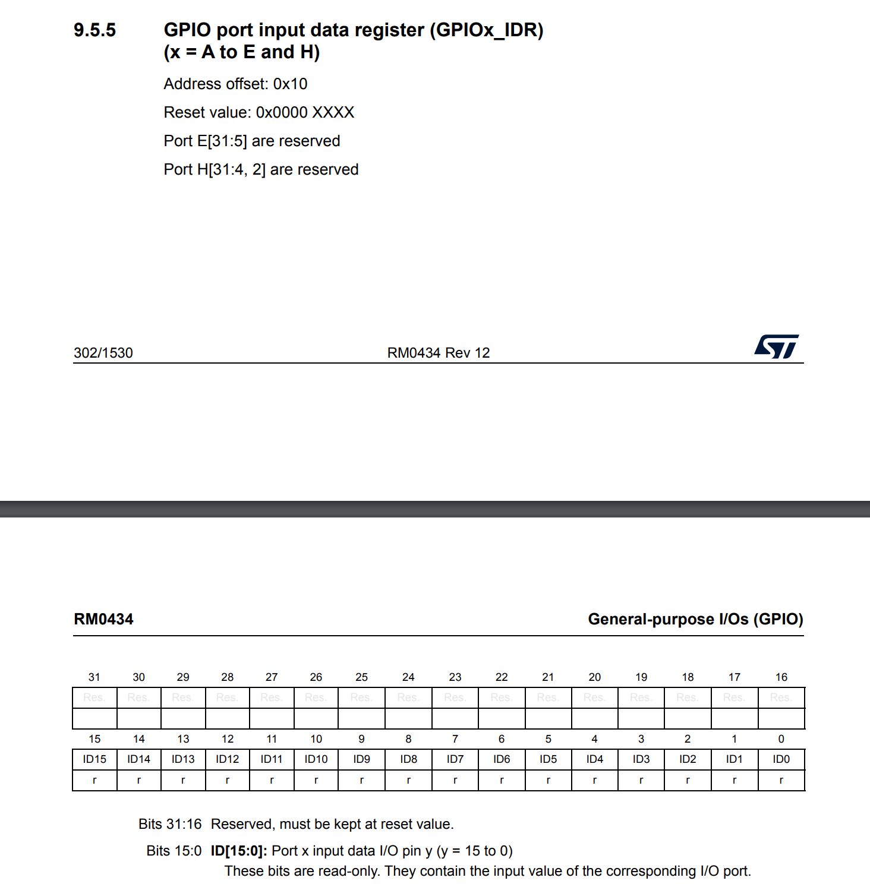
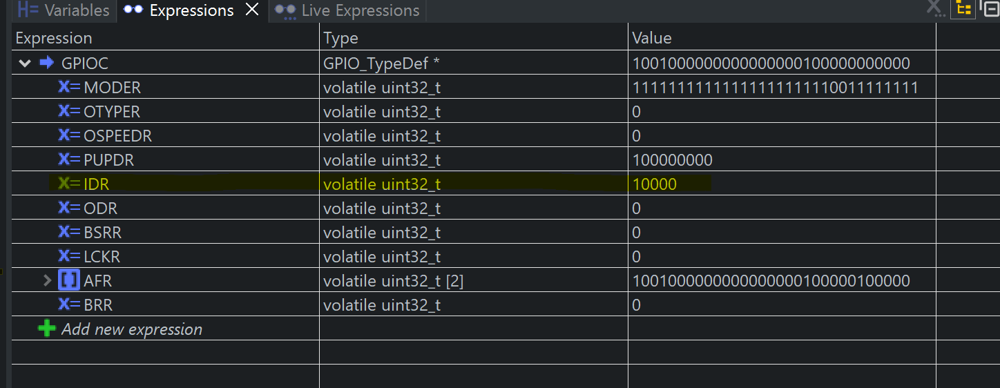
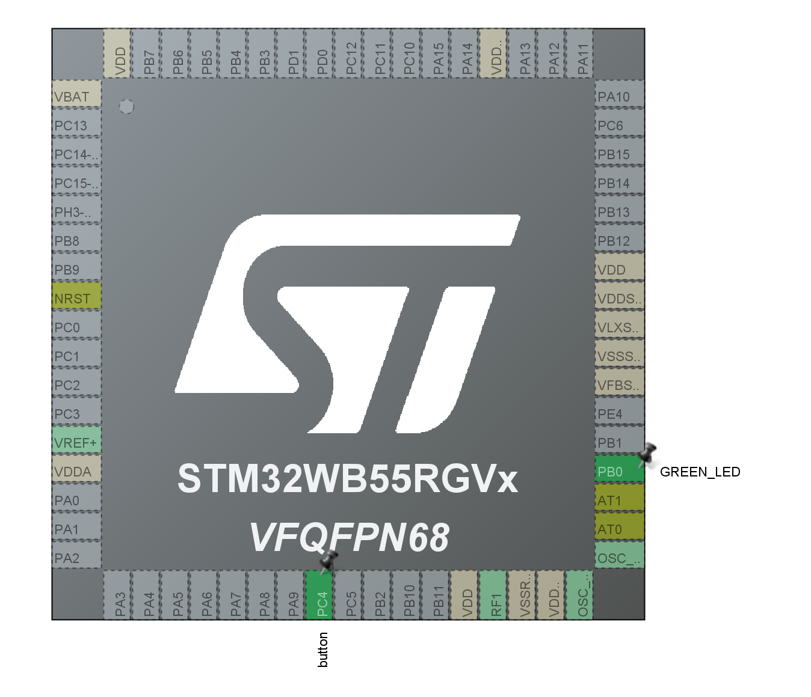

# making-embedded-systems
Output from Elecia White's "Making Embedded Systems" course. My project board is a P-NUCLEO-WB55 featuring an STM32WB55.

## homework_3 ##

### Task 1 ###
**On your final project board make blinky for yourself. Then add a button to turn the LED on and off.Bonus points for making the button cause an interrupt.Triple bonus points for debouncing the button signal.**

I have implemented all of these features in:
  - making_embedded_system_home_3/Core/Inc/user_code.h
  - making_embedded_system_home_3/Core/Src/user_code.c

### Task 2 ###
**Investigate further, using the processor manual:** (Answers from RM0434)
  - **Q: What are the hardware registers that cause the LED to turn on and off? (From the processor manual, don’t worry about initialization.)**
  - A: There's a bit reset register (BRR) for each GPIO port (A-E and H) on the micro and each bit in the register corresponds to a pin belonging to the GPIO port. The value of the bit corresponding to the led pin is what turns the LED led off or on.

  

  - **Q: What are the registers that you read in order to find out the state of the button?**

  - A: Similar to the BRR register there's an IDR register for every GPIO port on the micro and each bit corresponds to a pin of that port. 

  

  - **Q: Can you read the register directly and see the button change in a debugger or by printing out these value of the memory at the register’s address?**
  - A: The button I used is on PORTC and is pin 4. In the images below you can see that I have located the corresponding IDR register and have halted execution at the moment the ISR was triggered by a button press and the 5th bit (4th pin) of the IDR register for PORTC is high.
  
  

